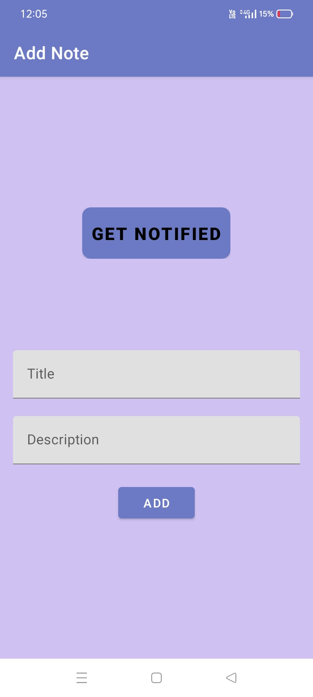
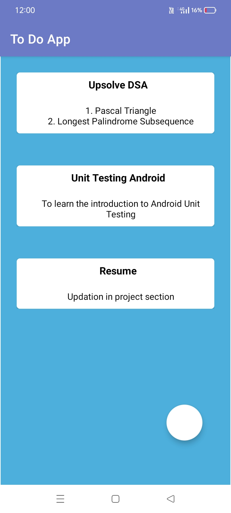
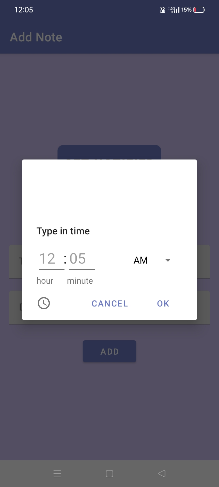
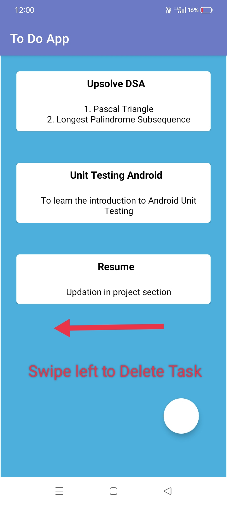
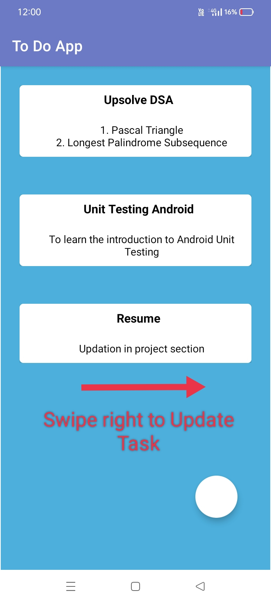

# 📝 To-Do App

A simple and productive to-do app that helps users manage tasks efficiently. Built using Java and XML for Android, the app enables users to create, update, and delete tasks, as well as set reminders for notifications. It utilizes Room Database for local storage, ensuring that tasks are always accessible.

## ✨ Features

- ✅ **Create Tasks**: Add tasks with a title and description.
- ✏️ **Update Tasks**: Edit existing tasks to keep them up to date.
- 🗑️ **Delete Tasks**: Remove tasks that are no longer needed.
- ⏰ **Set Reminders**: Get notified about tasks by setting reminder times.


## 📸 Screenshots
<table>
    <tr>
        <td align="center">
            
            <h3>📝 Add Daily Task</h3>
        </td>
        <td align="center">
            
            <h3>🏠 Home Page</h3>
        </td>
        <td align="center">
            
            <h3>⏰ Get Notified</h3>
        </td>
    </tr>
    <tr>
        <td align="center">
            
            <h3>🗑️ Delete Task</h3>
        </td>
        <td align="center">
            
            <h3>✏️ Update Task</h3>
        </td>
    </tr>
</table>

## 📱 Download APK

Download the latest APK to install the app on your Android device 
https://drive.google.com/file/d/14xnEgTy9yOGrUCOUPXLkLLJJCV56Ktre/view?usp=drive_link


## 🛠️ Technologies Used

- **Programming Language:** Java
- **UI Layout:** XML
- **Database:** Room Database (SQLite)
- **Notification:** Android AlarmManager/WorkManager for scheduling notifications

## 🚀 Setup Instructions

1. Clone the repository:
    ```bash
    git clone https://github.com/YourUsername/To_Do_App.git
    ```
2. Open the project in Android Studio.
3. Sync the project to download dependencies.
4. Run the app on an Android device or emulator.


